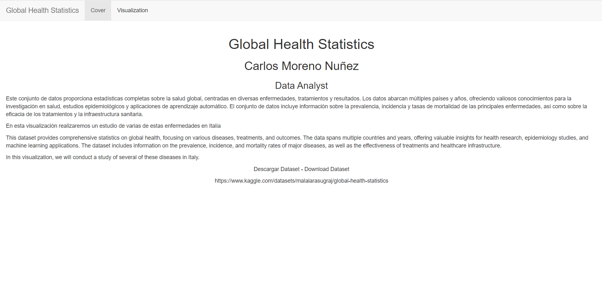
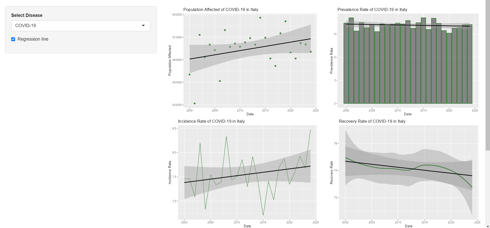

# Global Health Statistics

shiny: https://cmorenonunez98.shinyapps.io/Global_Health_Statistic/

Este conjunto de datos proporciona estadísticas completas sobre la salud global, centradas en diversas enfermedades, tratamientos y resultados. Los datos abarcan múltiples países y años, ofreciendo valiosos conocimientos para la investigación en salud, estudios epidemiológicos y aplicaciones de aprendizaje automático. El conjunto de datos incluye información sobre la prevalencia, incidencia y tasas de mortalidad de las principales enfermedades, así como sobre la eficacia de los tratamientos y la infraestructura sanitaria.

En esta visualización realizaremos un estudio de varias de estas enfermedades en Italia

This dataset provides comprehensive statistics on global health, focusing on various diseases, treatments, and outcomes. The data spans multiple countries and years, offering valuable insights for health research, epidemiology studies, and machine learning applications. The dataset includes information on the prevalence, incidence, and mortality rates of major diseases, as well as the effectiveness of treatments and healthcare infrastructure.

In this visualization, we will conduct a study of several of these diseases in Italy.

Descargar Dataset - Download Dataset

https://www.kaggle.com/datasets/malaiarasugraj/global-health-statistics

### Cover

### Visualization

