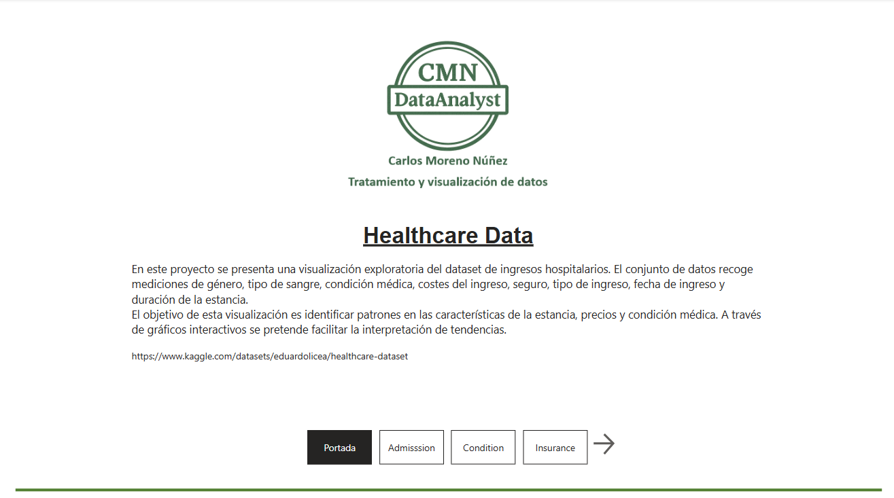
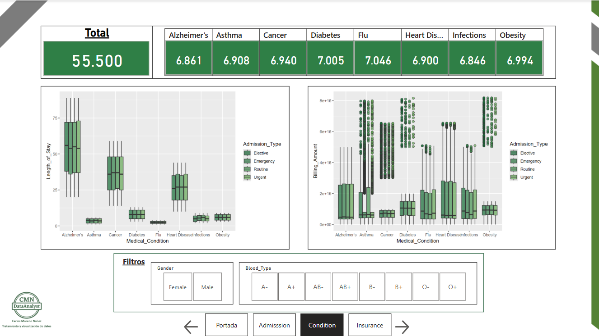
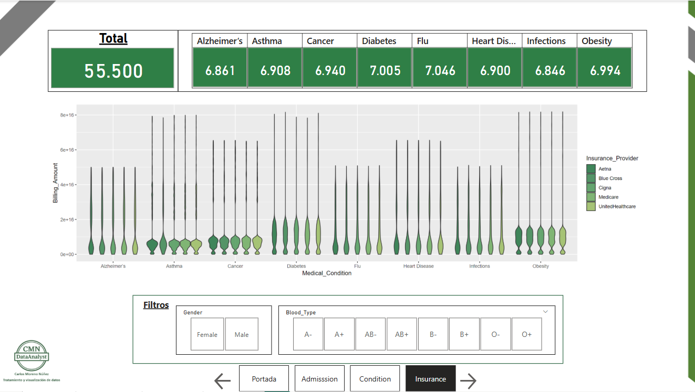

# Healthcare Dataset

En este proyecto se presenta una visualización exploratoria del dataset de ingresos hospitalarios. El conjunto de datos recoge mediciones de género, tipo de sangre, condición médica, costes del ingreso, seguro, tipo de ingreso, fecha de ingreso y duración de la estancia.

El objetivo de esta visualización es identificar patrones en las características de la estancia, precios y condición médica. A través de gráficos interactivos se pretende facilitar la interpretación de tendencias.

In this project, an exploratory visualization of the hospital admissions dataset is presented. The dataset includes measurements such as gender, blood type, medical condition, admission costs, insurance, type of admission, admission date, and length of stay.

The goal of this visualization is to identify patterns in stay characteristics, pricing, and medical condition. Interactive charts are used to facilitate the interpretation of trends.

Descargar dataset / Download dataset:
https://www.kaggle.com/datasets/eduardolicea/healthcare-dataset

### Cover

### Admission

### Condition

### Insurance

